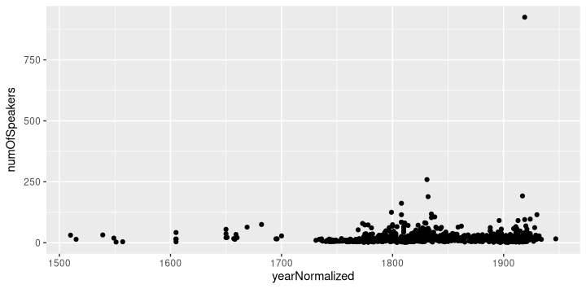
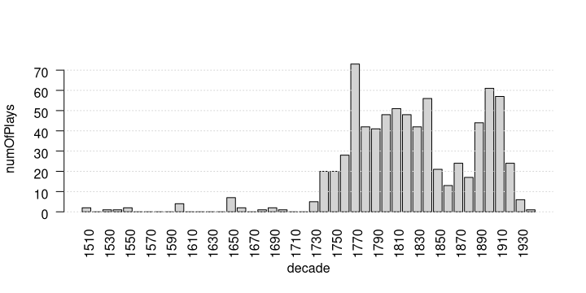

# GerDraCor
## Corpus Description
This is the German Drama Corpus (GerDraCor), a collection of [TEI-P5](https://tei-c.org/guidelines/p5/)-encoded German-language plays from 1730 to the 1940s. The corpus is released under the Creative Commons Zero copyright waiver ([CC0](https://creativecommons.org/share-your-work/public-domain/cc0/)).

If you want to cite the corpus, please use this publication:

- **Frank Fischer, Ingo Börner, Mathias Göbel, Angelika Hechtl, Christopher Kittel, Carsten Milling and Peer Trilcke (2019)**: Programmable Corpora. Die digitale Literaturwissenschaft zwischen Forschung und Infrastruktur am Beispiel von DraCor. *DHd 2019. Digital Humanities: multimedial & multimodal. Konferenzabstracts*, pp. 194–197. DOI: [10.5281/zenodo.2596094](https://doi.org/10.5281/zenodo.2596094).

We started to build the corpus by extracting all plays from TextGrid Repository (TGRep). The source for the versions in TGRep was [zeno.org's](http://www.zeno.org/) text collection. However, TGRep's conversion from zeno.org's proprietary XML to TEI caused some bugs and inconsistencies which we fixed for GerDraCor in a longer process between 2017 and 2019. [All our fixes including enhancements are documented on GerDraCor's Wiki.](https://github.com/dracor-org/gerdracor/wiki/Documentation-for-Correcting-Plays-from-TextGrid-Repository) After this clean-up process, GerDraCor is now in a position to grow by taking on new plays from sources such as Deutsches Textarchiv, Gutenberg-DE or Wikisource.

GerDraCor is an autonomous corpus and will be maintained independently. Yet it is also integrated into the [dracor.org website](https://dracor.org/), the showcase for our newly introduced **"Programmable Corpora"** concept.

If you just want to download the corpus in its current state in XML-TEI, do this:

`svn export https://github.com/dracor-org/gerdracor/trunk/tei`

## API
An easy way to download the network data (instead of the actual TEI files) is to use our API ([documentation here](https://dracor.org/documentation/api/)). If you have [jq](http://blog.librato.com/posts/jq-json) installed, it would work like this:

```
for play in `curl 'https://dracor.org/api/corpora/ger' | jq -r ".dramas[] .name"`; do
    wget -O "$play".csv https://dracor.org/api/corpora/ger/play/"$play"/networkdata/csv
done
```

The API info page is at `https://dracor.org/api/info`. It also tells you which version of eXist-db we're running on dracor.org.

## Simple Visualisation with R
To take a first look at the distribution of the number of speakers per play over time, you could feed the metadata table into R:

```
library(data.table)
library(ggplot2)
gerdracor <- fread("https://dracor.org/api/corpora/ger/metadata.csv")
ggplot(gerdracor[], aes(x = yearNormalized, y = numOfSpeakers)) + geom_point()
```

Result:



Here is a barplot showing the number of plays per decade:



## A Bit of History
Until we rebuilt our working corpus under its new name GerDraCor, we've been working with an [intermediary format](https://github.com/dlina/project/tree/master/data/zwischenformat) to conduct [our research](https://dlina.github.io/talks/). This format only held structural information, not the texts themselves. Back then, our research group called itself DLINA (digitally-enabled literary network analysis). Since our focus broadened, we stopped using this name. Our future endeavours will sail under the **Programmable Corpora** flag.

(README last updated on May 21, 2019.)
